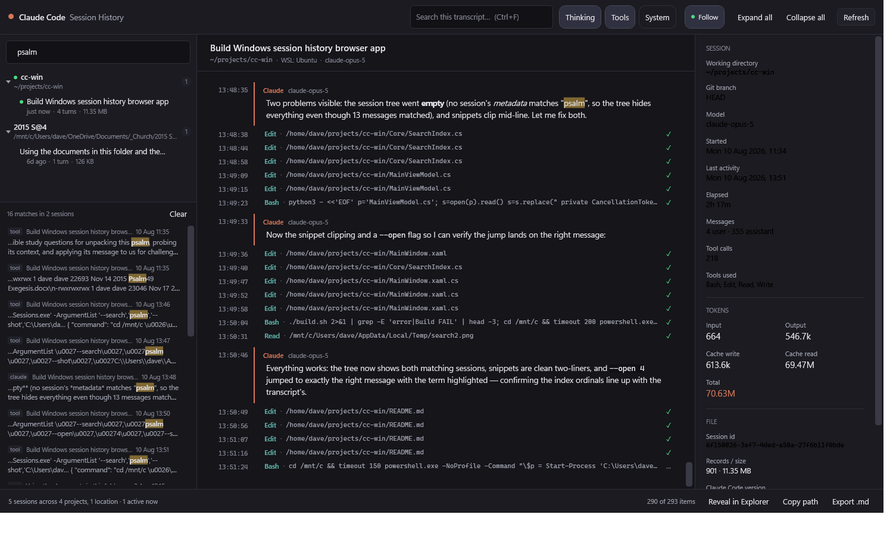

# Claude Code — Session History

A native Windows (WPF / .NET 10) app for browsing your Claude Code session history **live**.
It reads the `.jsonl` transcripts Claude Code writes under `~/.claude/projects` and tails them
as they grow, so a session you are running right now streams into the window as it happens.



## What it does

- **Finds every transcript automatically** — `%USERPROFILE%\.claude\projects` on Windows *and*
  `~/.claude/projects` inside every installed WSL distro, reached over `\\wsl.localhost`.
  Sessions are grouped by project and sorted most-recent-first.
- **Live tailing.** A one-second poll reads only the bytes appended since the last read, so a
  running session appears turn by turn. A green dot marks sessions written to in the last two
  minutes; **Follow** keeps the view pinned to the newest message and releases automatically
  when you scroll up.
- **Real transcript rendering** — user and assistant messages with lightweight Markdown
  (headings, lists, tables, block quotes, fenced code), collapsible thinking blocks, and each
  tool call paired with its result and a ✓ / ✕ / … status. Pasted and returned screenshots are
  rendered inline, and a date divider marks each new day.
- **Code reviews get their own rendering.** A `ReportFindings` call is a review result, not
  plumbing, so it is not shown as a tool call: findings are grouped by file, each one a card
  whose stripe and chip carry the verdict (confirmed / plausible / applied outcome), and each
  one keeps its **failure scenario** — the evidence for the finding, which the terminal's
  nested-list rendering drops. The collapsed header counts the findings by verdict.
- **Session details** — working directory, git branch, model, elapsed time, message and tool
  counts, and cumulative input / output / cache-read / cache-write token usage.
- **Full-text search across every session** — `Ctrl+K` searches message bodies, thinking,
  tool calls and tool output in every transcript it can see, not just the open one. Results
  show the matching text in context with the session and timestamp; clicking one opens that
  session scrolled to that exact message. Sessions whose *content* matched stay listed in the
  tree even when their titles do not.
- **Filters** — `Ctrl+F` searches within the open transcript, and the Thinking / Tools /
  System pills control how much detail is shown. API errors always stay visible.
- **A reading view, light or dark.** Message bodies are set in a serif face with generous line
  height and a fixed reading measure, so a long answer reads like a page rather than a log. The
  appearance button cycles **Auto / Light / Dark** — Auto follows the Windows app theme — and
  the choice is remembered across launches. Switching recolours the running window, title bar
  included, without a restart.
- **Resume in Terminal** opens a new terminal running `claude --resume <id>` for the selected
  session, in that session's own working directory — and inside the WSL distro the transcript
  came from, when it came from one. A login shell is used because `claude` normally lives on a
  PATH a profile sets up, and the shell stays open after claude exits.
- **Export** a transcript to Markdown, reveal the `.jsonl` in Explorer, or copy the session id
  or file path from the copy icons in the FILE details.

## Build

Requires the .NET 10 SDK **on Windows** (already present if `dotnet --list-sdks` works from
PowerShell). From WSL:

```bash
./build.sh              # Release; use ./build.sh Debug for a debug build
```

The source can live in WSL, but the build output must land on a Windows drive — Windows
blocks launching an executable straight from a `\\wsl.localhost` path. `build.sh` installs to
`%LOCALAPPDATA%\ClaudeSessions`.

Then run `%LOCALAPPDATA%\ClaudeSessions\ClaudeSessions.exe`.

## Shortcuts and the taskbar

```powershell
powershell.exe -ExecutionPolicy Bypass -File tools\install-shortcuts.ps1
```

This creates a **Start Menu** entry (so the app shows up in search and All Apps) and then
*attempts* a taskbar pin. Windows 11 deliberately blocks programmatic pinning for ordinary
Win32 apps — the shell's `taskbarpin` verb is hidden — so the script verifies the result
against the folder the shell really keeps pinned shortcuts in and tells you plainly whether
it took. It will not silently claim success.

When it reports `NOT PINNED`, do the one manual step Windows requires: launch the app, then
right-click its taskbar button → **Pin to taskbar**. It sticks from then on.

`tools\make-icon.ps1` regenerates `app.ico` (the Claude spark on a dark plate) at the nine
sizes Windows asks for. Small sizes are written as 32bpp DIB entries rather than PNG, because
GDI+ and some shell consumers do not decode PNG-compressed icon entries.

## Command line

| Flag | Effect |
|---|---|
| `--session <text>` | Open the first session whose title, id, path or model matches `<text>` |
| `--root <dir>` | Scan an extra history folder — an archived or copied `projects` tree |
| `--find <text>` | Pre-fill the transcript search, so the session opens filtered and highlighted |
| `--search <text>` | Run a full-text search across all sessions on startup |
| `--open <n>` | With `--search`, jump straight to the nth result (0-based) |
| `--shot <file> [secs]` | Render the window to a PNG after `secs` and exit (used for the screenshot above) |
| `--expand` | With `--shot`, expand tool and thinking blocks before capturing |

## How it reads the transcripts

Each session is one append-only `.jsonl` file whose records are heterogeneous: `user` and
`assistant` messages, plus `ai-title`, `last-prompt`, `file-history-*`, `attachment`, `mode`
and others. The app keeps a byte offset per file and an unterminated-line buffer, so a record
that is only half-flushed when the poll fires is never parsed until it is complete.

A few things worth knowing about the format, since they shape what you see:

- A `tool_use` block and its `tool_result` live in **different records** — the result arrives in
  a later `user` record and is matched back by `tool_use_id`. That pairing is stateful, so it
  still works when the two records arrive in different polls.
- Most `user` records are not things you typed: tool results, injected `<system-reminder>`
  context and meta turns all use the same role. These are classified as plumbing and shown
  only under the **System** pill, which is why "messages" counts look lower than record counts.
- `thinking` blocks are often present but carry an **empty** `thinking` string (signature only).
  Those are skipped rather than rendered as blank rows, so a session can legitimately show no
  thinking at all.
- The project folder name is the working directory with separators replaced by dashes, which
  is lossy for directories that contain real dashes. The app prefers the authoritative `cwd`
  recorded inside the transcript and only falls back to decoding the folder name.

## How search works

There is no persisted index. The first search over a session parses it once into plain-text
records; later searches only read the bytes the file has grown by, reusing the same tail
reader as the transcript view. That reuse is load-bearing rather than incidental: because the
index is produced by the *same* timeline builder, a hit's ordinal is exactly the transcript
item's ordinal, which is what lets a result scroll to the right message.

Two consequences worth knowing:

- A tool's output arrives in a later record than its call, so the builder raises an event when
  it pairs them and the index rewrites that record — otherwise tool output would be missing
  from search until the app restarted.
- Retained text is capped (~32M characters); past that, the least recently searched sessions
  are dropped and re-read on demand. Results are capped at 300 per query, and the summary line
  says so explicitly rather than quietly truncating.

Typing filters the session list immediately; the content scan is debounced and runs off the UI
thread, and an in-flight scan is cancelled when the query changes. New sessions appearing
re-run an active query, but a session merely *growing* does not, so results hold still while
you click them.

## How theming works

`Theme.xaml` declares one `SolidColorBrush` per themed colour; `ThemePalette` holds the two
colour sets and `ThemeManager` **replaces** those dictionary entries when the theme changes.
Two constraints shaped that design, and both are easy to trip over:

- Every themed colour must be referenced with `DynamicResource`, not `StaticResource`. A
  `StaticResource` resolves once at load and never hears about the swap.
- The brushes cannot simply be recoloured in place. WPF freezes some of them while sealing
  styles and templates, and assigning to a frozen brush throws — so the entry is replaced
  rather than mutated.

`MarkdownBlock` renders into a `FlowDocument`, which bakes in whatever brush instance it is
given, so its code, quote, bullet and link colours are attached with `SetResourceReference`
instead. That also avoids an ordering trap: swapping the foreground rebuilds the document
synchronously, part-way through the swap, while the remaining brushes are still stale.

## Layout

| Path | Contents |
|---|---|
| `Core/Model.cs` | Record and content-block parsing from JSON |
| `Core/SessionTail.cs` | Incremental byte-offset reader; rolling per-session summary |
| `Core/Timeline.cs` | Records → renderable items, and tool-call/result pairing |
| `Core/SearchIndex.cs` | Lazy per-session text index and the cross-session search |
| `Core/Findings.cs` | Parses a `ReportFindings` call into its own presentable model |
| `Core/Discovery.cs` | Windows + WSL history-root discovery |
| `MainViewModel.cs` | Scanning, polling, filtering, commands |
| `Ui/MarkdownBlock.cs` | The lightweight Markdown renderer |
| `MainWindow.xaml` | Layout and the per-item templates |
| `Theme.xaml` | Control styles, and the brush keys both palettes fill |
| `Core/ThemePalette.cs` | The light and dark colour sets |
| `Core/ThemeManager.cs` | Runtime theme swapping and OS-theme detection |
| `Core/AppSettings.cs` | The remembered appearance choice |

No third-party packages — everything is in-box .NET.
